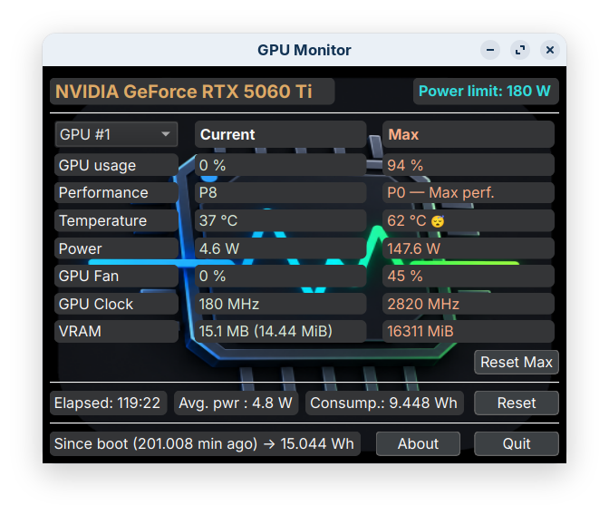

# NVIDIA GPU Monitor

Lightweight NVIDIA GPU monitor for LLM benchmarking, development and
general GPU monitoring.

## Overview

GPU Monitor is a lightweight graphical monitoring tool for NVIDIA GPUs.

It provides a real-time view of GPU resources while running applications
or workloads, with a particular focus on LLM inference, development and
benchmarking.

It can also be used for general GPU monitoring, including gaming.

## Features

- Real-time GPU monitoring
- GPU utilization
- GPU memory / VRAM usage
- GPU power consumption
- GPU temperature
- Session monitoring
- Session reset
- Support for NVIDIA GPUs
- Lightweight native application

## Current release

**v1.0.0 — Linux x86-64**

The Linux release executable is under 200 KB in its compressed form.

...

